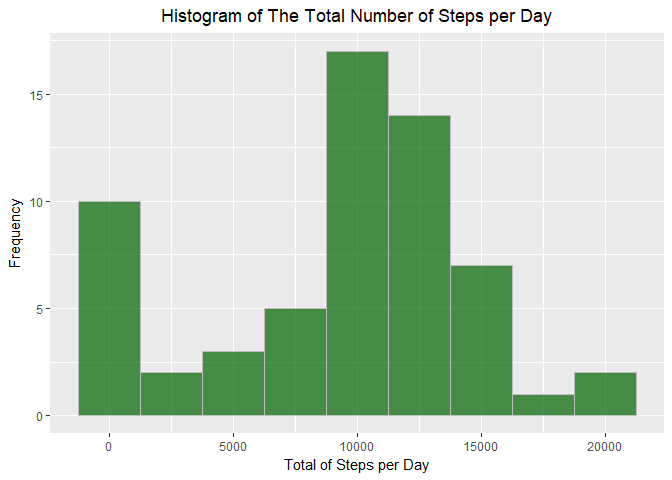
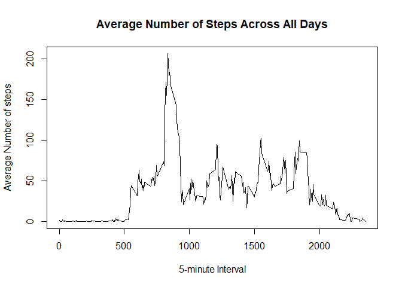
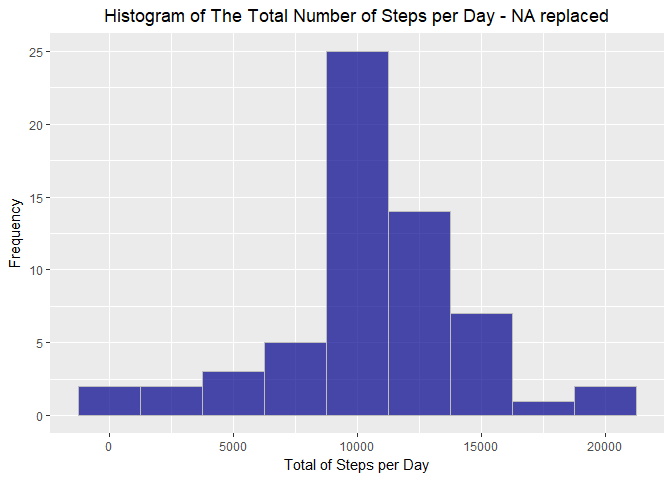
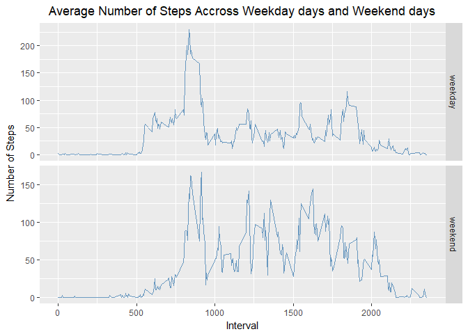

## Loading and preprocessing the data

Load required packages


```r
## loading packages
require(lubridate)
require(dplyr)
require(ggplot2)
```

Load the data


```r
if (!file.exists("./activity.csv")){
      unzip("./activity.zip")
}
dataset <- read.csv("./activity.csv", header = TRUE, sep = ",")
```

Preprocess the data


```r
dataset$date <- ymd(as.character(dataset$date))
```

## What is mean total number of steps taken per day?

Make a histogram of the total number of steps taken each day


```r
by_date <- group_by(dataset, date)
steps_by_date <- summarise(by_date, total = sum(steps, na.rm = TRUE))
freq <- ggplot(steps_by_date, aes(total))
freq + geom_histogram(binwidth = 2500, color = "grey", fill = "darkgreen", alpha = 0.7) +
      ggtitle("Histogram of The Total Number of Steps per Day") +
      theme(plot.title = element_text(hjust = 0.5)) +
      xlab("Total of Steps per Day") +
      ylab("Frequency")
```

<!-- -->

Calculate and report the mean and median total number of steps taken per day


```r
mean(steps_by_date$total, na.rm = TRUE)
```

```
## [1] 9354.23
```

```r
median(steps_by_date$total, na.rm = TRUE)
```

```
## [1] 10395
```

## What is the average daily activity pattern?

Make a time series plot (i.e. type = "l") of the 5-minute interval (x-axis) and the average number of steps taken, averaged across all days (y-axis)


```r
by_interval <- group_by(dataset, interval)
steps_by_interval <- summarise(by_interval, mean = mean(steps, na.rm = TRUE))
plot(steps_by_interval$interval, steps_by_interval$mean, type = "l",
     xlab = "5-minute Interval",
     ylab = "Average Number of steps",
     main = "Average Number of Steps Across All Days"
)
```

<!-- -->

Which 5-minute interval, on average across all the days in the dataset, contains the maximum number of steps?


```r
max_steps <- filter(steps_by_interval, mean == max(steps_by_interval$mean))
max_steps
```

```
## # A tibble: 1 x 2
##   interval  mean
##      <int> <dbl>
## 1      835  206.
```

## Imputing missing values

Calculate and report the total number of missing values in the dataset (i.e. the total number of rows with NAs)


```r
sum(is.na(dataset$steps))
```

```
## [1] 2304
```

Devise a strategy for filling in all of the missing values in the dataset

- The strategy will be replace all missing values by the mean for that 5-minute interval

Create a new dataset that is equal to the original dataset but with the missing data filled in


```r
filled_data <- merge(dataset, steps_by_interval)
for (i in 1:nrow(filled_data)){
      if (is.na(filled_data$steps[i])){
            filled_data$steps[i] <- filled_data$mean[i]
      }
}
filled_data <- filled_data[,1:3]
```

Make a histogram of the total number of steps taken each day and Calculate and report the mean and median total number of steps taken per day


```r
by_date_filled <- group_by(filled_data, date)
steps_by_date_filled <- summarise(by_date_filled, total = sum(steps, na.rm = TRUE))

## plot the histogram
freq <- ggplot(steps_by_date_filled, aes(total))
freq + geom_histogram(binwidth = 2500, color = "grey", fill = "darkblue", alpha = 0.7) +
      ggtitle("Histogram of The Total Number of Steps per Day - NA replaced") +
      theme(plot.title = element_text(hjust = 0.5)) +
      xlab("Total of Steps per Day") +
      ylab("Frequency")
```

<!-- -->

Calculate de mean and median total number of steps per day


```r
mean(steps_by_date_filled$total)
```

```
## [1] 10766.19
```

```r
median(steps_by_date_filled$total)
```

```
## [1] 10766.19
```

Do these values differ from the estimates from the first part of the assignment? What is the impact of imputing missing data on the estimates of the total daily number of steps?

- Yes, there is an increase of the mean and median values and they become equal with the strategy adopted

## Are there differences in activity patterns between weekdays and weekends?

Create a new factor variable in the dataset with two levels -- "weekday" and "weekend" indicating whether a given date is a weekday or weekend day


```r
## Eliminating regional differences
curr_locale <- Sys.getlocale("LC_TIME")
Sys.setlocale("LC_TIME","C")

## Determining the day of the week
steps_by_weekday <- mutate(filled_data, weekday = weekdays(date, abbreviate = TRUE))

## Replacing the abbreviate date with the category of the weekdays
for (i in 1:nrow(steps_by_weekday)){
      if (steps_by_weekday$weekday[i] %in% c("Sat", "Sun")){
            steps_by_weekday$weekday[i] <- "weekend"
      }
      else {
            steps_by_weekday$weekday[i] <- "weekday"
      }
}

## Setting back current locale
Sys.setlocale("LC_TIME",curr_locale)
```

Make a panel plot containing a time series plot (i.e. type = "l") of the 5-minute interval (x-axis) and the average number of steps taken, averaged across all weekday days or weekend days (y-axis)


```r
by_interval_weekday <- group_by(steps_by_weekday, interval, weekday)
steps_by_interval_wd <- summarise(by_interval_weekday, mean = mean(steps, na.rm = TRUE))
g <- ggplot(steps_by_interval_wd, aes(x = interval, y = mean)) +
      geom_line(linetype = 1, colour = "steelblue", alpha = 0.8) +
      facet_grid(weekday~., scales = "free") +
      ggtitle("Average Number of Steps Accross Weekday days and Weekend days") +
      theme(plot.title = element_text(hjust = 0.5)) +
      xlab("Interval") +
      ylab("Number of Steps")
print(g)
```

<!-- -->
